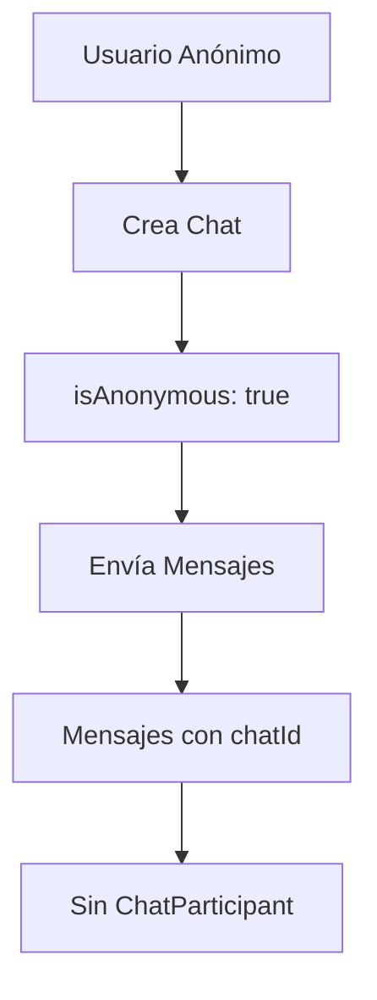
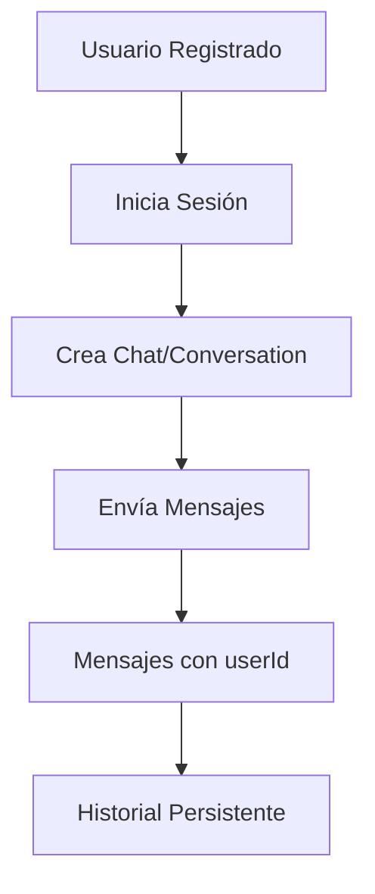

# 📊 Lógica del Esquema de Base de Datos - Sistema de Chat

## 🎯 **Resumen Ejecutivo**

Tu sistema tiene un esquema híbrido que soporta tanto **chats anónimos** como **conversaciones de usuarios registrados**, pero hay algunas inconsistencias en la implementación actual.

## 🏗️ **Arquitectura del Sistema**

### **1. Modelos Principales**

#### **👤 User (Usuarios)**

- **Propósito**: Usuarios registrados y autenticados
- **Estado actual**: 6 usuarios registrados
- **Características**:
  - Soporte para OAuth (Google, GitHub) y autenticación local
  - Multi-tenancy opcional (tenantId)
  - Roles: SUPER_ADMIN, ADMIN, USER

#### **🏢 Tenant (Multi-tenancy)**

- **Propósito**: Aislamiento de datos por organización/empresa
- **Estado actual**: 0 registros (NO SE ESTÁ USANDO)
- **Problema**: La funcionalidad multi-tenant está definida pero no implementada

#### **💬 Conversation (Conversaciones)**

- **Propósito**: Conversaciones formales de usuarios registrados
- **Estado actual**: 3 conversaciones
- **Características**:
  - Vinculada a un usuario específico
  - Título personalizable
  - Historial persistente

#### **🗨️ Chat (Chats)**

- **Propósito**: Sesiones de chat (anónimas y registradas)
- **Estado actual**: 9 chats (todos anónimos)
- **Características**:
  - Soporte para chats anónimos (`isAnonymous: true`)
  - Owner opcional
  - Más flexible que Conversation

#### **👥 ChatParticipant (Participantes)**

- **Propósito**: Gestión de participantes en chats grupales
- **Estado actual**: 0 registros (NO SE ESTÁ USANDO)
- **Problema**: Diseñado para chats grupales que no se han implementado

#### **📝 Message (Mensajes)**

- **Propósito**: Contenido de los mensajes
- **Estado actual**: 66 mensajes
- **Características**:
  - Puede pertenecer a `Conversation` O `Chat`
  - Roles: USER, ASSISTANT, SYSTEM
  - Tracking de tokens utilizados

## 🔍 **Análisis de Inconsistencias**

### **❌ Problema 1: Duplicación de Conceptos**

```
Conversation vs Chat
├── Conversation: Para usuarios registrados (3 registros)
└── Chat: Para sesiones flexibles (9 registros, todos anónimos)
```

**Problema**: Tienes dos entidades que hacen cosas similares pero diferentes.

### **❌ Problema 2: Tablas No Utilizadas**

```
Tablas sin datos:
├── ChatParticipant (0 registros)
└── Tenant (0 registros)
```

### **❌ Problema 3: Lógica de Mensajes Confusa**

Los mensajes pueden pertenecer a:

- `conversationId` (para Conversation)
- `chatId` (para Chat)

Pero en la práctica, parece que solo se usa `chatId`.

## 🎯 **Lógica Actual del Sistema**

### **Flujo de Chat Anónimo**



### **Flujo de Usuario Registrado**



## 🚀 **Recomendaciones de Mejora**

### **Opción 1: Simplificar (Recomendada)**

```sql
-- Eliminar Conversation, usar solo Chat
-- Eliminar ChatParticipant (no se usa)
-- Mantener Tenant para futuro multi-tenancy
```

### **Opción 2: Clarificar Roles**

```sql
-- Conversation: Para chats 1-a-1 con IA
-- Chat: Para salas grupales (futuro)
-- ChatParticipant: Para gestión de grupos
```

## 📋 **Estado Actual por Tabla**

| Tabla             | Registros | Estado      | Uso                               |
| ----------------- | --------- | ----------- | --------------------------------- |
| `User`            | 6         | ✅ Activa   | Usuarios registrados              |
| `Chat`            | 9         | ✅ Activa   | Sesiones de chat (todas anónimas) |
| `Message`         | 66        | ✅ Activa   | Contenido de mensajes             |
| `Conversation`    | 3         | ⚠️ Parcial  | Solo algunos usuarios             |
| `Subscription`    | 6         | ✅ Activa   | Planes de suscripción             |
| `UsageRecord`     | 6         | ✅ Activa   | Tracking de uso                   |
| `ChatParticipant` | 0         | ❌ Inactiva | No implementada                   |
| `Tenant`          | 0         | ❌ Inactiva | No implementada                   |

## 🔧 **Acciones Recomendadas**

### **Inmediatas**

1. **Decidir entre Chat vs Conversation**: Elegir una estrategia
2. **Implementar ChatParticipant**: Si planeas chats grupales
3. **Activar Tenant**: Si necesitas multi-tenancy

### **Futuras**

1. **Migración de datos**: Consolidar Conversation → Chat
2. **Implementar chats grupales**: Usar ChatParticipant
3. **Multi-tenancy**: Activar Tenant para organizaciones

## 💡 **Conclusión**

Tu esquema está bien diseñado pero tiene **sobre-ingeniería** para el uso actual. Tienes dos sistemas paralelos (Chat/Conversation) cuando probablemente solo necesitas uno. Las tablas `ChatParticipant` y `Tenant` están preparadas para funcionalidades futuras que aún no se han implementado.

**Recomendación**: Simplifica usando solo `Chat` y elimina `Conversation` para evitar confusión.
