# Configuración OAuth (Google & GitHub)

## ✅ Google OAuth - CONFIGURADO

### Credenciales:

- **Client ID**: `23226684733-q12ncrqsirt4rof20setfo86fca84ddo.apps.googleusercontent.com`
- **Client Secret**: `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`
- **Callback URL**: `http://localhost:3000/api/auth/google/callback`
- **Frontend Origin**: `http://localhost:3001`

### URLs de redirección autorizadas en Google Console:

✅ `http://localhost:3000/api/auth/google/callback`
✅ `http://127.0.0.1:3000/api/auth/google/callback`

### Orígenes de JavaScript autorizados:

✅ `http://localhost:3001`

### Testing Google Login:

1. Inicia el backend: `npm run start:dev`
2. Ve a: `http://localhost:3000/api/auth/google`
3. Autentícate con tu cuenta Google
4. Serás redirigido a: `http://localhost:3001/auth/callback?token=JWT_TOKEN`

---

## ⏳ GitHub OAuth - PENDIENTE CONFIGURAR

### Pasos para configurar GitHub OAuth:

1. **Ve a GitHub Settings:**
   - https://github.com/settings/developers

2. **Click en "New OAuth App"**

3. **Completa el formulario:**
   - **Application name**: `SaaS Backend UNCSM`
   - **Homepage URL**: `http://localhost:3001`
   - **Authorization callback URL**: `http://localhost:3000/api/auth/github/callback`
   - **Description**: Backend SaaS con autenticación multiestrategy

4. **Copia las credenciales generadas:**
   - Client ID
   - Client Secret

5. **Actualiza tu `.env`:**

   ```env
   GITHUB_CLIENT_ID=tu_github_client_id_aqui
   GITHUB_CLIENT_SECRET=tu_github_client_secret_aqui
   GITHUB_CALLBACK_URL=http://localhost:3000/api/auth/github/callback
   ```

6. **Reinicia el servidor:**
   ```bash
   npm run start:dev
   ```

### Testing GitHub Login:

1. Ve a: `http://localhost:3000/api/auth/github`
2. Autentícate con tu cuenta GitHub
3. Serás redirigido a: `http://localhost:3001/auth/callback?token=JWT_TOKEN`

---

## 🔒 Seguridad

⚠️ **Los archivos de credenciales están en `.gitignore`:**

- `/google/`
- `/github/`
- `client_secret*.json`
- `*.apps.googleusercontent.com.json`
- `.env`

❌ **NUNCA subas estos archivos a Git/GitHub**

---

## 📝 Endpoints OAuth Disponibles

### Google:

- **Iniciar login**: `GET /api/auth/google`
- **Callback**: `GET /api/auth/google/callback`

### GitHub:

- **Iniciar login**: `GET /api/auth/github`
- **Callback**: `GET /api/auth/github/callback`

### Local (Email/Password):

- **Registro**: `POST /api/auth/register`
- **Login**: `POST /api/auth/login`
- **Profile**: `GET /api/auth/profile` (requiere JWT)

---

## 🎯 Flujo OAuth Completo

```mermaid
sequenceDiagram
    Frontend->>Backend: GET /api/auth/google
    Backend->>Google: Redirect a Google OAuth
    User->>Google: Autenticación
    Google->>Backend: Callback con código
    Backend->>Backend: Crear/actualizar usuario
    Backend->>Backend: Generar JWT
    Backend->>Frontend: Redirect a /auth/callback?token=JWT
    Frontend->>Frontend: Guardar token en localStorage
    Frontend->>Backend: Requests con Authorization: Bearer JWT
```



---

## 🧪 Testing con cURL

### Google (abre en navegador, cURL no funciona para OAuth flow):

```bash
# Abre en navegador:
http://localhost:3000/api/auth/google
```

### Login Local:

```bash
curl -X POST http://localhost:3000/api/auth/login \
  -H "Content-Type: application/json" \
  -d '{
    "email": "rolmo33@saas.com",
    "password": "Jenny23.!"
  }'
```

### Profile con JWT:

```bash
curl -X GET http://localhost:3000/api/auth/profile \
  -H "Authorization: Bearer TU_JWT_TOKEN_AQUI"
```
