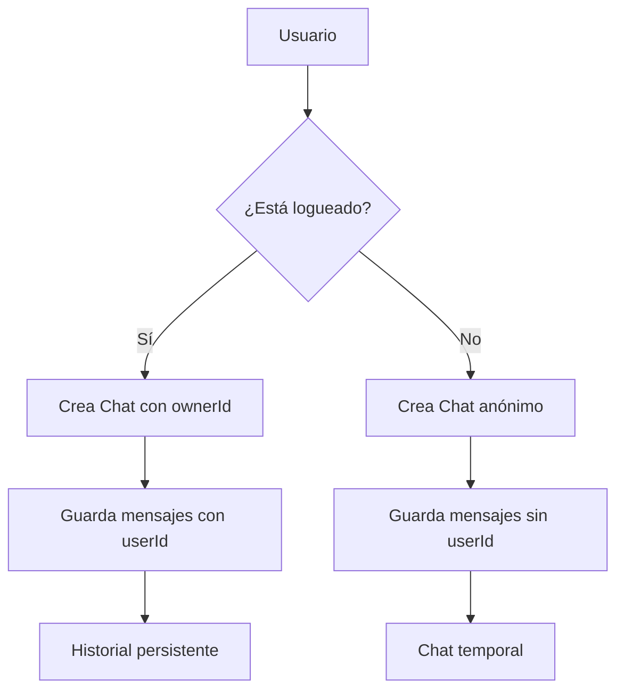

# 🔧 Simplificación del Esquema de Base de Datos

## 🎯 **Objetivo**

Eliminar la duplicación `Chat` vs `Conversation` y usar un solo sistema unificado.

## 📋 **Plan de Simplificación**

### **Paso 1: Migrar datos de Conversation → Chat**

```sql
-- Migrar las 3 conversaciones existentes a Chat
INSERT INTO chats (id, title, isAnonymous, ownerId, createdAt, updatedAt)
SELECT
    id,
    title,
    false as isAnonymous,  -- Ya no son anónimas
    userId as ownerId,
    createdAt,
    updatedAt
FROM conversations;

-- Migrar mensajes de conversationId → chatId
UPDATE messages
SET chatId = conversationId
WHERE conversationId IS NOT NULL;
```

### **Paso 2: Actualizar el esquema Prisma**

```prisma
// ELIMINAR Conversation completamente
// ELIMINAR ChatParticipant (no se usa)
// MANTENER Tenant para futuro multi-tenancy

model Chat {
  id          String  @id @default(uuid())
  title       String  @default("Nueva conversación")
  isAnonymous Boolean @default(false)

  // Owner (usuario registrado) o null (anónimo)
  ownerId String?
  owner   User?   @relation("UserChats", fields: [ownerId], references: [id])

  // Timestamps
  createdAt DateTime @default(now())
  updatedAt DateTime @updatedAt

  // Relaciones
  messages Message[]

  @@index([ownerId])
  @@index([createdAt])
  @@map("chats")
}

model Message {
  id      String @id @default(uuid())
  chatId  String // SOLO chatId, eliminar conversationId
  chat    Chat   @relation(fields: [chatId], references: [id], onDelete: Cascade)

  userId  String?
  user    User?   @relation(fields: [userId], references: [id], onDelete: SetNull)
  role    MessageRole
  content String  @db.Text
  model   String  @default("deepseek-r1:7b")
  tokensUsed Int  @default(0)

  // Attachments
  attachments String[]

  // Timestamps
  createdAt DateTime @default(now())

  @@index([chatId])
  @@index([userId])
  @@index([createdAt])
  @@map("messages")
}
```

### **Paso 3: Actualizar el backend**

```typescript
// En ChatService
async createChat(ownerId?: string, title?: string): Promise<Chat> {
  return this.prisma.chat.create({
    data: {
      title: title || "Nueva conversación",
      isAnonymous: !ownerId, // Si no hay ownerId, es anónimo
      ownerId: ownerId,
    },
  });
}

async getUserChats(userId: string): Promise<Chat[]> {
  return this.prisma.chat.findMany({
    where: {
      ownerId: userId, // Solo chats del usuario
    },
    orderBy: { updatedAt: 'desc' },
    include: {
      messages: {
        orderBy: { createdAt: 'asc' },
        take: 1, // Solo el último mensaje para el título
      },
    },
  });
}
```

## 🎯 **Resultado Final**

### **Flujo Simplificado:**



### **Estructura Final:**

- ✅ **Un solo sistema**: Solo `Chat`
- ✅ **Usuarios registrados**: `ownerId` + `isAnonymous: false`
- ✅ **Usuarios anónimos**: `ownerId: null` + `isAnonymous: true`
- ✅ **Historial persistente**: Para usuarios registrados
- ✅ **Multi-tenancy**: Preparado con `Tenant` (futuro)

## 🔧 **Implementación**

¿Quieres que implemente esta simplificación? Los pasos serían:

1. **Crear migración** para mover datos
2. **Actualizar esquema Prisma**
3. **Actualizar backend** (ChatService, ChatController)
4. **Actualizar frontend** (Flutter) si es necesario
5. **Eliminar tablas** no utilizadas

¿Procedo con la implementación?
