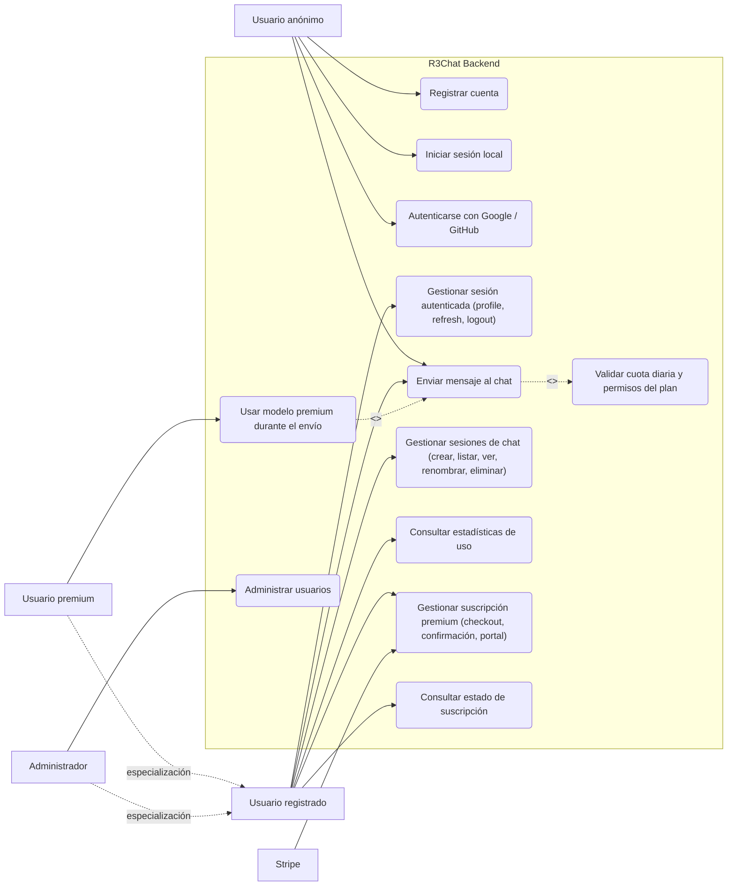

# Diagrama de Casos de Uso del Backend

## Descripción

Este diagrama identifica los **actores externos** que interactúan con el backend de R3Chat y los **casos de uso respaldados por endpoints o flujos reales** de la implementación actual. Se priorizan los procesos de autenticación, chat, sesiones, uso, suscripciones y administración; por eso se excluyen como foco principal funciones que hoy no tienen un flujo público completo, como la gestión de tenants o el manejo formal de adjuntos.

## Explicación de las relaciones

- **Especialización de actores:** `Usuario premium` hereda los casos de uso de `Usuario registrado` y agrega el uso de **modelos premium** (`gemini`, `openai`, `deepseek`) durante el envío de mensajes. `Administrador` también hereda la base de autenticación y suma la administración de usuarios.
- **Inclusión obligatoria:** `Enviar mensaje al chat` incluye `Validar cuota diaria y permisos del plan`, porque en el código el backend siempre consulta límites de uso y nivel de suscripción antes de invocar al proveedor de IA.
- **Integración externa con Stripe:** `Gestionar suscripción premium` resume los flujos reales de `create-checkout-session`, `confirm-session`, `create-portal-session` y el procesamiento del webhook que actualiza la suscripción.
- **Alcance controlado:** no se modelan como casos principales la administración de tenants ni el upload formal de adjuntos, porque no están expuestos hoy como flujo público principal en esta rama del backend.
