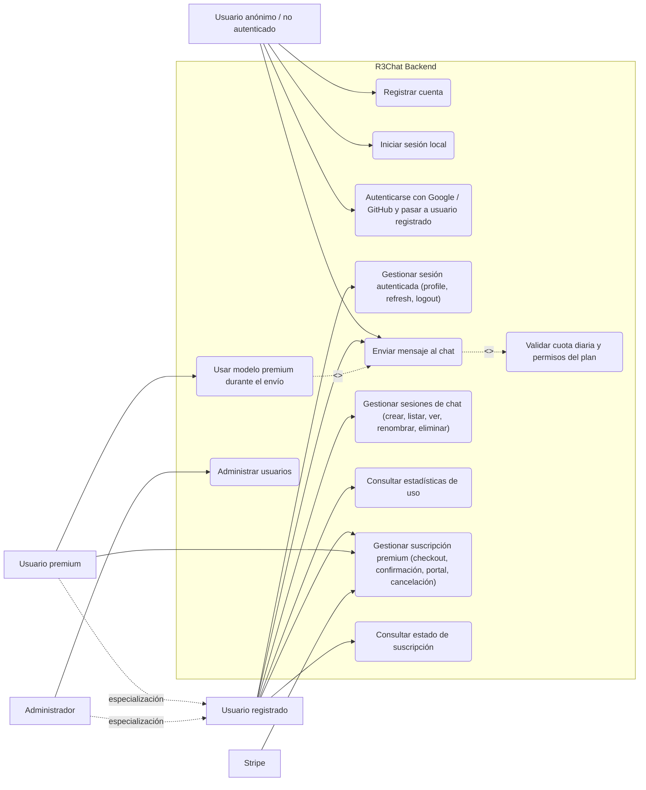

# Diagrama de Casos de Uso del Backend

## Descripción

Este diagrama identifica los **actores externos** que interactúan con el backend de R3Chat y los **casos de uso respaldados por endpoints o flujos reales** de la implementación actual. Se priorizan los procesos de autenticación, chat, sesiones, uso, suscripciones y administración. Además, se aclara que la autenticación social con Google o GitHub **crea o reutiliza** una cuenta con rol `USER`, es decir, un **usuario registrado** dentro del backend.

## Explicación de las relaciones

- **Autenticación social y transición a registrado:** en `apps/auth/src/auth-domain.service.ts`, el flujo `validateOAuthUser()` crea o reutiliza un usuario con rol `USER`; por eso `Autenticarse con Google / GitHub` se interpreta como el punto en que el usuario no autenticado **pasa al conjunto de usuarios registrados**.
- **Especialización de actores:** `Usuario premium` hereda los casos de uso de `Usuario registrado` y agrega el uso de **modelos premium** (`gemini`, `openai`, `deepseek`) durante el envío de mensajes. `Administrador` también hereda la base de autenticación y suma la administración de usuarios a nivel de backend.
- **Inclusión obligatoria:** `Enviar mensaje al chat` incluye `Validar cuota diaria y permisos del plan`, porque en el código el backend siempre consulta límites de uso y nivel de suscripción antes de invocar al proveedor de IA.
- **Acceso por tier:** el usuario registrado puede conversar y consumir **modelos públicos**, pero si solicita `gemini`, `openai` o `deepseek` el backend responde con error salvo que su tier sea `PREMIUM`, tal como se valida en `apps/chat/src/chat-domain.service.ts`.
- **Integración externa con Stripe:** `Gestionar suscripción premium` resume los flujos reales de `create-checkout-session`, `confirm-session`, `create-portal-session` y la **cancelación/actualización** procesada por Stripe y sus webhooks.
- **Matiz importante sobre el actor anónimo:** el backend actual **sí permite** envío de mensajes anónimos usando `anonymousId`, aunque ese flujo no persiste historial igual que el autenticado. Por eso el actor anónimo sigue conectado a `Enviar mensaje al chat`.
- **Administración implementada en backend:** los endpoints de administración existen en `src/users/users.controller.ts` con `@Roles('ADMIN')`; sin embargo, en esta rama **no se verifica una interfaz visual administrativa**, así que el actor `Administrador` debe entenderse como una capacidad expuesta por el backend, no como una pantalla ya visible en UI.
