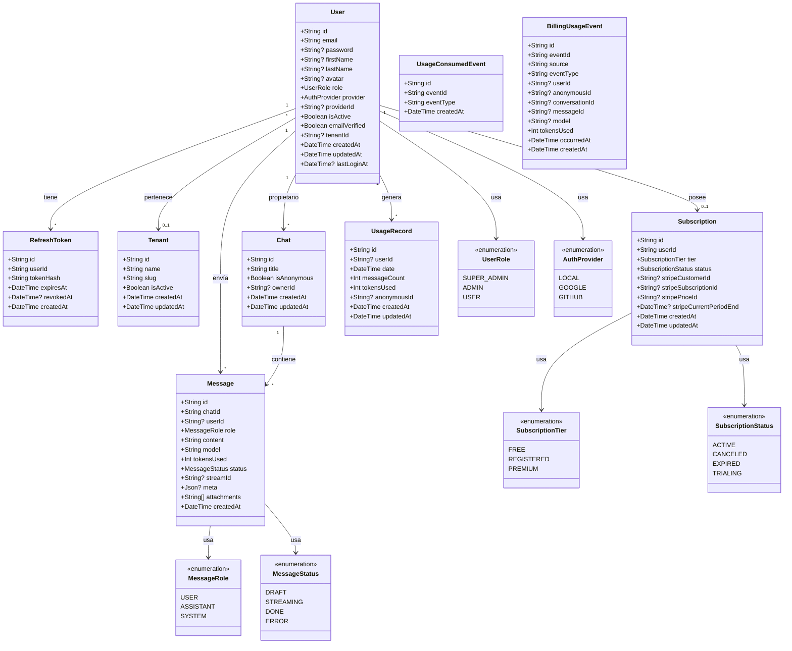

# Diagrama de Clases

## Descripción
El diagrama de clases modela las entidades principales del dominio de la **SaaS Platform**, extraídas directamente del esquema de Prisma. Se representan los atributos clave, los enums del sistema y las relaciones entre entidades (asociación, agregación y composición). Las entidades se organizan en cuatro schemas lógicos de PostgreSQL: `users`, `chat`, `billing` y `usage`.

## Notas técnicas
- **Composición:** `RefreshToken` y `Subscription` dependen de la existencia de un `User`; si el usuario se elimina, estos registros se eliminan en cascada (`onDelete: Cascade`).
- **Agregación:** `Message` pertenece a un `Chat`; la eliminación del chat borra todos sus mensajes en cascada.
- **Asociación opcional:** un `Chat` puede ser anónimo (`ownerId` nullable), permitiendo interacciones sin autenticación previa.
- **Idempotencia:** `UsageConsumedEvent` evita el doble conteo de eventos de uso consumidos por el microservicio `usage`.
