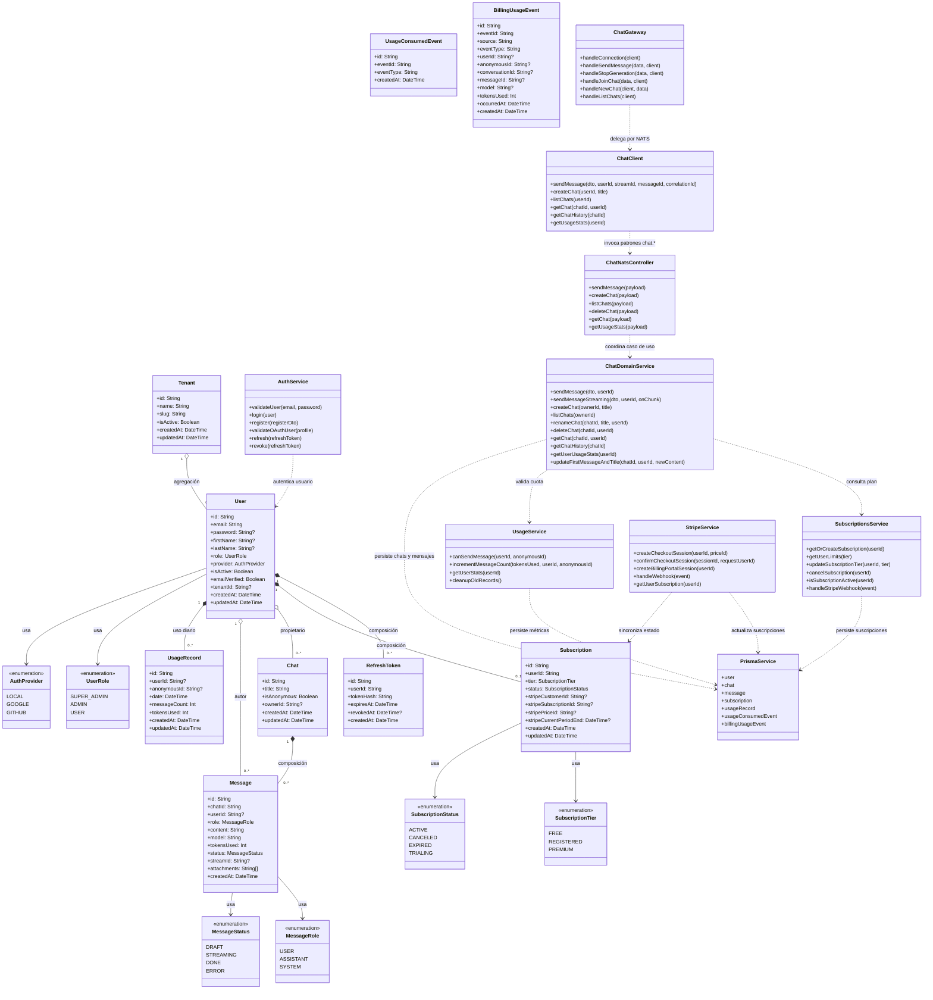

# Diagrama de Clases

## Descripción

El siguiente diagrama combina las **entidades persistentes reales** del esquema Prisma con las **clases de aplicación** que orquestan los casos de uso principales del backend. De esta forma se cubren los tres elementos que pide la entrega: **atributos**, **métodos** y **relaciones**. Las entidades reflejan el dominio almacenado en PostgreSQL; las clases de servicio representan la lógica presente en el gateway HTTP/WS y en los microservicios.

## Notas técnicas

- Las clases `User`, `RefreshToken`, `Tenant`, `Subscription`, `Chat`, `Message`, `UsageRecord`, `UsageConsumedEvent` y `BillingUsageEvent` provienen directamente de `prisma/schema.prisma`.
- Las composiciones reflejan el comportamiento del esquema real: por ejemplo, `RefreshToken` y `Subscription` dependen del ciclo de vida de `User`, y `Message` depende de `Chat`.
- `UsageConsumedEvent` registra **idempotencia** para evitar doble conteo cuando el microservicio `usage` consume `chat.events.usage.incremented`.
- `BillingUsageEvent` conserva **auditoría** tanto del evento `chat.events.message.created` como de `chat.events.usage.incremented` en el microservicio `billing`.
- La relación con `Tenant` se conserva porque existe en el dominio persistente, aunque el flujo público de administración de tenants no se modela como caso de uso principal en esta entrega.
