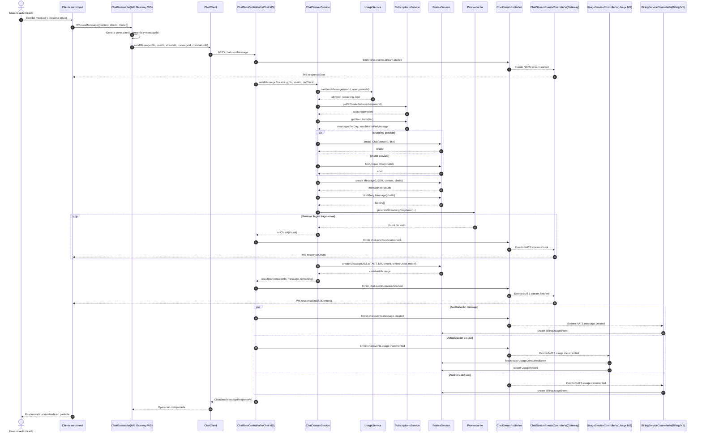

# Diagrama de Secuencia

## Descripción

Este diagrama representa el **escenario clave del backend**: un **usuario autenticado** envía un mensaje por **WebSocket** y recibe una respuesta en **streaming**. El flujo sigue exactamente la cadena real de la implementación: `ChatGateway` recibe el evento, delega el envío al microservicio de chat mediante **NATS**, el microservicio procesa la lógica de dominio, publica eventos `chat.events.stream.*` y el gateway retransmite los eventos de vuelta al cliente como `responseStart`, `responseChunk` y `responseEnd`.

## Explicación del flujo

1. **Entrada en tiempo real:** el usuario entra por `sendMessage` en `ChatGateway`, que registra identificadores de correlación y delega el procesamiento al microservicio de chat.
2. **Validación sincrónica:** antes de invocar la IA, `ChatDomainService` consulta `UsageService` y `SubscriptionsService` para validar la cuota diaria y el plan del usuario.
3. **Persistencia del contexto:** si la conversación es autenticada, el backend crea o recupera el chat, guarda el mensaje del usuario y carga el historial desde PostgreSQL.
4. **Streaming desacoplado:** el microservicio de chat no escribe directo al socket; publica `chat.events.stream.started`, `chat.events.stream.chunk` y `chat.events.stream.finished`, y luego `ChatStreamEventsController` los convierte en `responseStart`, `responseChunk` y `responseEnd` para el cliente.
5. **Postprocesamiento asíncrono:** al finalizar, el sistema publica `chat.events.message.created` y `chat.events.usage.incremented`; `usage` actualiza métricas e idempotencia, mientras `billing` registra trazabilidad de auditoría.
6. **Variante anónima:** el flujo de usuario anónimo usa `anonymousId` para el control de cuota, pero no persiste historial del mismo modo que una conversación autenticada.
