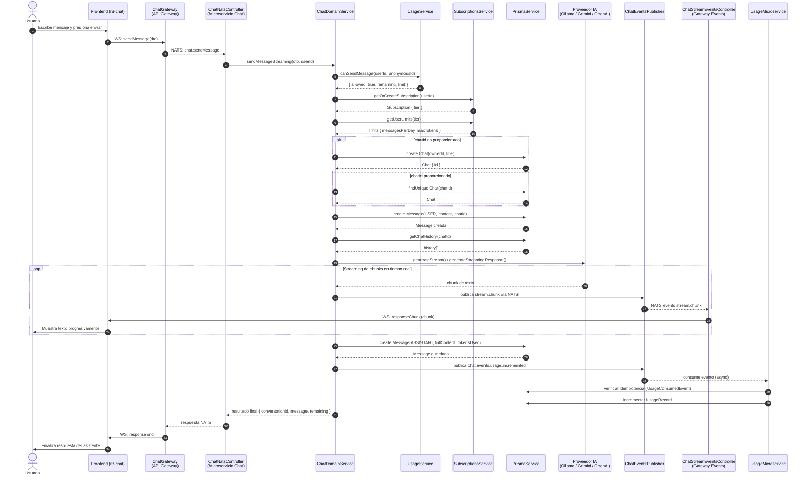

# Diagrama de Secuencia

## Descripción
Este diagrama ilustra el escenario clave del sistema: **el envío de un mensaje de chat con streaming en tiempo real**. Se representa la interacción completa entre el frontend, el API Gateway (WebSocket), el microservicio de chat, los servicios de dominio (uso y suscripciones), Prisma, el proveedor de IA, y los consumidores de eventos.

## Explicación del flujo
1. **Autenticación inicial:** el `ChatGateway` valida al usuario antes de aceptar la conexión WebSocket.
2. **Rate limiting:** `ChatDomainService` consulta `UsageService` para verificar que el usuario no haya excedido su cuota diaria según su `SubscriptionTier` (FREE, REGISTERED o PREMIUM).
3. **Gestión de sesiones:** si no existe un `chatId`, se crea una nueva conversación con título autogenerado.
4. **Persistencia histórica:** el mensaje del usuario se guarda en la base de datos antes de llamar a la IA.
5. **Streaming:** los chunks generados por el proveedor de IA se publican como eventos NATS y se retransmiten al frontend vía WebSocket, logrando una experiencia de escritura en tiempo real.
6. **Eventos de dominio:** al finalizar, se publica `chat.events.usage.incremented`, que es consumido asíncronamente por el microservicio `usage` para actualizar estadísticas y por `billing` para auditoría.
