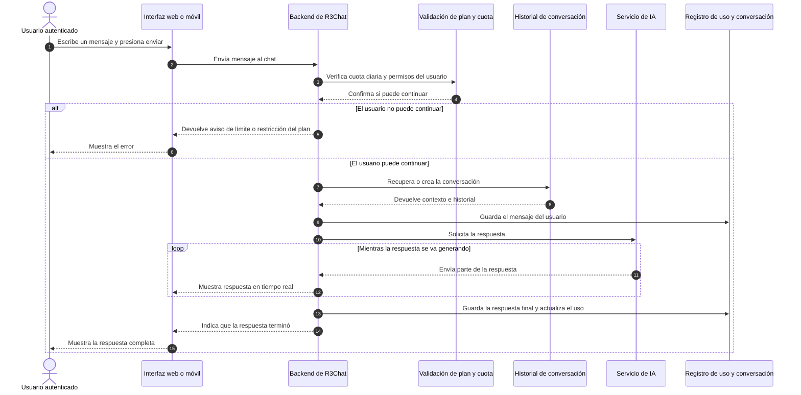

# Diagrama de Secuencia

## Descripción

Este diagrama representa, de forma **más simple y fácil de entender**, el escenario principal del sistema: un **usuario autenticado** envía un mensaje, el backend valida si puede atenderlo, consulta a la IA y devuelve la respuesta en tiempo real. Se omiten nombres internos demasiado técnicos para que cualquier lector pueda seguir el proceso sin conocer la arquitectura completa.

## Explicación del flujo

1. **Inicio de la interacción:** el usuario escribe un mensaje desde la aplicación y este se envía al backend.
2. **Control de acceso:** antes de responder, el sistema revisa si el usuario todavía tiene cuota disponible y si el modelo solicitado corresponde a su plan.
3. **Preparación del contexto:** el backend recupera la conversación actual o crea una nueva, para que la respuesta tenga continuidad.
4. **Consulta a la IA:** el backend envía el mensaje al servicio de inteligencia artificial seleccionado.
5. **Respuesta en tiempo real:** mientras la IA genera el contenido, la aplicación lo va mostrando por partes para que la experiencia sea más fluida.
6. **Cierre del proceso:** cuando la respuesta termina, el sistema guarda la conversación y actualiza las métricas de uso del usuario.

## Nota de simplificación

Este diagrama fue redactado en un nivel **funcional** y no en nivel técnico interno. En el código real existen componentes adicionales de transporte, eventos y microservicios, pero aquí se agrupan para priorizar la claridad y la comprensión del proceso principal.
