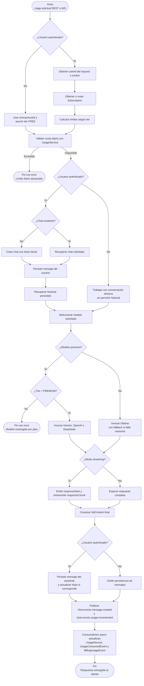

# Diagrama de Actividades

## Descripción

Este diagrama resume el proceso interno del backend al recibir un mensaje de chat, distinguiendo los casos de **usuario autenticado** y **usuario anónimo**, la **validación de cuota**, la **restricción de modelos premium** y la diferencia entre **respuesta completa** y **streaming**. También deja explícito que el historial persistente solo aplica de forma consistente a los chats autenticados.

## Explicación de decisiones clave

- **Autenticado vs. anónimo:** el backend admite ambos escenarios, pero el usuario anónimo trabaja con `anonymousId` y **no persiste historial del mismo modo** que un chat autenticado.
- **Validación previa de cuota:** el control de uso ocurre antes de llamar al proveedor de IA, evitando gasto innecesario de tokens y garantizando coherencia con el plan del usuario.
- **Restricción de modelos premium:** si el modelo solicitado es `gemini`, `openai` o `deepseek`, el sistema exige `SubscriptionTier.PREMIUM`; de lo contrario, responde con error.
- **Dos modos de respuesta:** el backend soporta respuesta completa y streaming. En streaming, el cliente recibe `responseStart`, varios `responseChunk` y finalmente `responseEnd`.
- **Telemetría desacoplada:** el uso y la auditoría no bloquean la respuesta principal; se registran a través de consumidores asíncronos que actualizan `UsageRecord`, `UsageConsumedEvent` y `BillingUsageEvent`.
