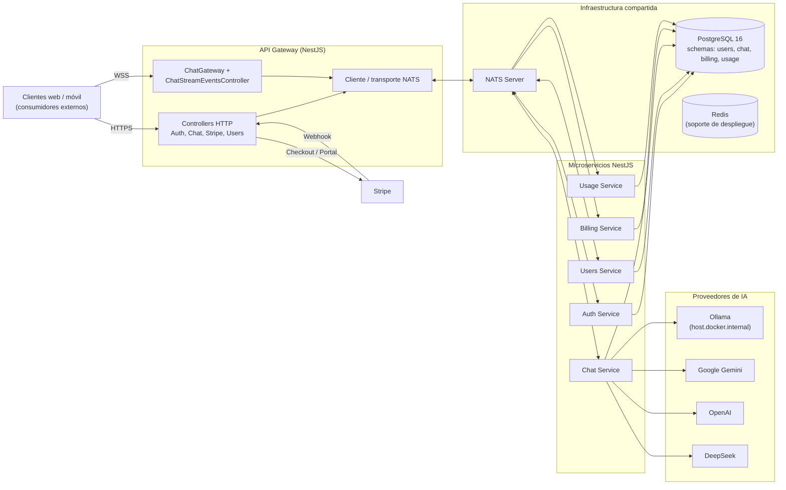
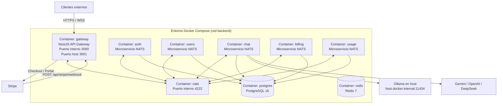

# Diagramas de Componentes y Despliegue

## Diagrama de Componentes

### Descripción

Este diagrama presenta la arquitectura **backend-only** de R3Chat. Los clientes web o móvil se representan únicamente como **consumidores externos** del backend, mientras que el centro del sistema está formado por el **API Gateway**, los **microservicios NestJS**, la **infraestructura compartida** y los **servicios externos** de pagos e IA.

### Explicación

- El **API Gateway** concentra los endpoints HTTP, el namespace WebSocket `/chat` y la recepción de eventos de streaming que luego retransmite al cliente.
- Los microservicios `auth`, `users`, `chat`, `billing` y `usage` se coordinan mediante **NATS**, lo que desacopla el procesamiento de la interfaz pública.
- **PostgreSQL** es la persistencia compartida del backend, separada lógicamente por esquemas para cada dominio.
- **Redis** figura como infraestructura de despliegue porque está presente en `docker-compose.prod.yml`, aunque no es el eje de los flujos principales documentados aquí.
- **Stripe** y los proveedores de IA aparecen fuera del backend porque son dependencias externas integradas por HTTP/API.

---

## Diagrama de Despliegue

### Descripción

Este diagrama refleja la topología real de despliegue definida en `docker-compose.prod.yml`. El backend se distribuye en varios contenedores conectados a una red interna `backend`. El **gateway** es el único punto de entrada público; el resto de servicios se comunican internamente por **NATS** y persisten en **PostgreSQL**.

### Notas de despliegue

- El contenedor `gateway` es el **único componente expuesto** hacia clientes externos; los demás servicios permanecen en la red interna.
- El contenedor `chat` consume modelos locales a través de `host.docker.internal` para Ollama y también puede invocar proveedores cloud.
- `billing` y `usage` no atienden tráfico público: reaccionan a eventos publicados por el microservicio `chat`.
- El servicio `migrate` definido en el compose se omite del diagrama porque corresponde a una tarea operativa puntual de migración, no a un nodo de ejecución permanente.
- `Redis` se mantiene en el despliegue real y por eso aparece en el diagrama, aunque su participación no sea central en los flujos UML principales de esta entrega.
