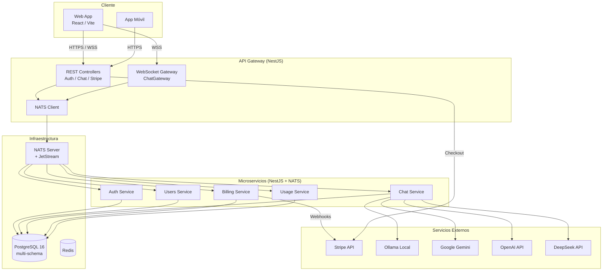
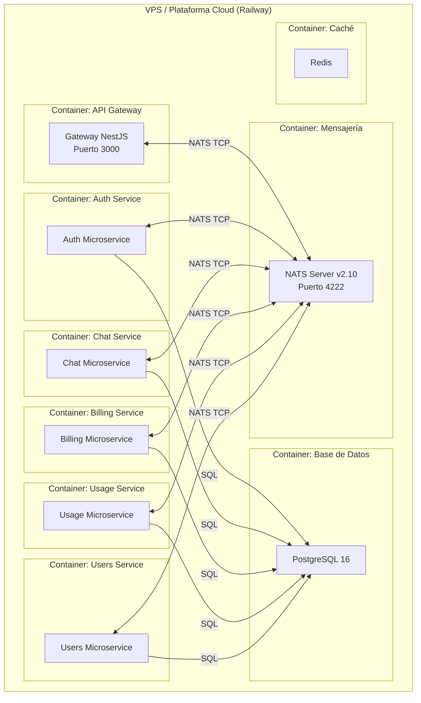

# Diagrama de Componentes y Despliegue

## Diagrama de Componentes

### Descripción
Este diagrama muestra la organización de los componentes de software de alto nivel. Se distingue el cliente (frontend y móvil), el API Gateway que centraliza el acceso, los microservicios especializados, la infraestructura interna (base de datos, caché, bus de mensajes) y los servicios externos (Stripe y proveedores de IA).

---

## Diagrama de Despliegue

### Descripción
El diagrama de despliegue refleja la topología de infraestructura en un entorno productivo (VPS o Railway). Cada servicio corre en su propio contenedor Docker, orquestados con Docker Compose. El API Gateway es el único punto de entrada expuesto públicamente; los microservicios y la base de datos residen en una red interna.

## Notas de arquitectura
- **API Gateway como fachada:** centraliza autenticación, enrutamiento y documentación Swagger. Expone REST API en `/api` y WebSockets en `/chat`.
- **Comunicación asíncrona:** todos los microservicios se comunican a través de NATS, desacoplando el frontend de la lógica interna y permitiendo escalar servicios de forma independiente.
- **Persistencia compartida:** aunque los microservicios son independientes, comparten una misma instancia de PostgreSQL separada lógicamente por schemas (`users`, `chat`, `billing`, `usage`). Esta es una decisión de transición del monolito hacia arquitectura distribuida.
- **Despliegue uniforme:** todos los contenedores se construyen desde la misma imagen base de NestJS, cambiando únicamente el entrypoint (`node dist/apps/<service>/main.js`).
